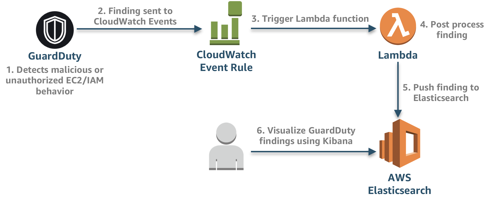

# Processing Guardduty Findings with Lambda

This serverless application creates the necessary resources and integrations for processing [Amazon GuardDuty](https://aws.amazon.com/guardduty/) findings. The below architecture showcases how logs are post-processed, and pushed to Elasticsearch.

## Architecture



## Prerequisites

Below are the necessary prerequisites:

*	[AWS Account](https://aws.amazon.com/premiumsupport/knowledge-center/create-and-activate-aws-account/)
*	[Serverless Framework](https://serverless.com/)
*	An [Amazon Elasticsearch](https://aws.amazon.com/elasticsearch-service/) cluster.  This application builds on [aws-cloudtrail-processing](https://github.com/jmfuchs/aws-cloudtrail-processing) in an effort to consolidate more AWS native log sources but can also be run independently.

### Cloud9 Environment

If you have trouble installing any of the prerequisites or dependencies, you can spin up an [AWS Cloud9](https://aws.amazon.com/cloud9/) environment, which is a cloud-based IDE that comes prepackaged with a number of essential packages.  After which you can run the following command to install the Serverless Framework.

```
npm install -g serverless
```

## Set Variables

Clone the repo and open up **environment/dev.yml** and add in the appropiate variables. 

>  You can add new files for different environments.

## Enrich Logs

Since the Lambda Function parses through the GuardDuty finding, you can enrich the finding by adding additional information to complement data points and add context.  This can either be static data hardcoded in the Lambda function or it can be dynamically pulled from a DynamoDB table or 3rd party threat intelligence feed. 

Open **guardduty.py**, find the section of code below, and add additional metadata as necessary:

```
############# Add additional metadata to event #############
            
# Example: Add AWS Account type
i["accountType"] = "Production" 

############################################################
``` 


## Install Dependencies

Ensure you are in the aws-ct-processing directory and run the following to install the dependencies:

```
pip install -r requirements.txt -t ./
```

## Deploy

To deploy the serverless application, run the following command:

```
sls deploy -s dev -r us-west-2
```

> If you've created different environment files that reference other aws profiles or you want to deploy to different regions, you can replace *dev* and *us-west-2* as necessary.

## Access

After to the application has been successfully deployed you can view the logs in Kibana by doing the following:

* Go to the [AWS Elasticsearch](https://us-west-2.console.aws.amazon.com/es/home?region=us-west-2) console.
* Click on the Domain that starts with **sls-aws-ct-processing**.
* Click the link next to **Kibana**.

Once you are in Kibana:

* Click **Management** in the left Navigation.
* Click **Index Patterns**
* For Step 1 (Define index pattern) type **logs-\***.
* For Step 2 (Configure Settings) select **@timestamp**.
* Click **Create Index Pattern**.
* On the left navigation, click **Discover** to view your events.

## Cleanup

Below are the steps to cleanup this application:

* 	Manually delete the [S3 bucket](https://s3.console.aws.amazon.com/s3/home?region=us-west-2) you specificed in the dev.yml file.
	
	> You have to manually delete this bucket because there is now data in the bucket and as a protection mechanism CloudFormation will **not** delete buckets it created if data exists in that bucket.
* 	Run the below command to delete the serverless application

	```
	sls remove  -s dev -r us-west-2
	```